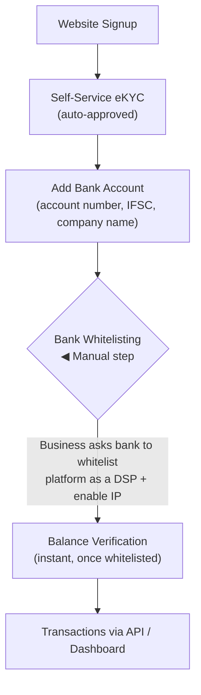
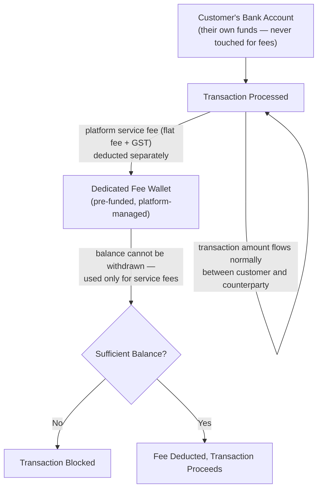

# Fintech Connected Banking Platform

**A self-service, API-driven multi-bank account management platform — QA & Automation Portfolio Project**

> This repository documents the QA strategy, test automation, and testing approach applied to a
> **Connected Banking platform** — a fintech product that lets businesses consolidate and manage
> multiple bank accounts, and transact against them, through a single self-service dashboard and
> unified API.
>
> All content here uses **generic/sample data only**. No client names, company names, banking
> partner names, or confidential/production information are included. Numbers used to illustrate
> commercial structure and test design are representative examples, not live production pricing.
>
> 📍 **New here?** [`docs/README.md`](./docs/README.md) is a documentation map answering "what is
> this, how does it work, who's involved, what does it depend on" — with a recommended reading
> order through every doc in this repo, including the real activation SOP.

---

## 📖 Table of Contents

1. [What is a Connected Banking Platform?](#-what-is-a-connected-banking-platform)
2. [My Role](#-my-role)
3. [Tech Stack & Tools Used](#-tech-stack--tools-used)
4. [Types of Testing Performed](#-types-of-testing-performed)
5. [How It Works — Onboarding & Fee Model](#-how-it-works--onboarding--fee-model)
6. [Key Achievements](#-key-achievements)
7. [📈 Performance & Load Testing](#-performance--load-testing)
8. [Automation Approach](#-automation-approach)
9. [Regression Checklist](#-regression-checklist)
10. [Screenshots & Reports](#-screenshots--reports)
11. [Repository Structure](#-repository-structure)

> Deeper dives not covered inline in this README: [Stakeholders & Dependencies](./docs/business-overview.md),
> [Service Architecture](./docs/service-architecture.md), [Shared Platform Services](./docs/shared-platform-services.md),
> [UI Consistency](./docs/ui-consistency.md), [Real Activation User Guide](./docs/user-guide-activate-connected-banking.md),
> [Tech Stack & Skills Index](./docs/tech-and-skills.md), [Sample RTM](./sample-rtm.md)
> — see [`docs/README.md`](./docs/README.md) for the full map.

---

## 💡 What is a Connected Banking Platform?

A **Connected Banking platform** lets a business link multiple bank accounts to a single
dashboard and interact with all of them — checking balances, viewing transactions, and
initiating payments — through **one unified API**, instead of integrating separately with each
bank.

If you're new to fintech QA, HR, or any non-technical role: imagine a business that holds
accounts at three different banks. Normally, that means three different net-banking logins,
three different bank API integrations (each with its own approval process, IP whitelisting, and
legal paperwork), and three places to reconcile balances. A Connected Banking platform collapses
all of that into **one login and one API**, acting as the business's own alternative net-banking
system.

### What makes this category of product distinct

- **100% self-service onboarding** — sign-up, eKYC, and account linking happen without manual
  approval, unlike traditional bank-integration processes that can take weeks
- **API-driven, not just a dashboard** — built primarily for businesses (e.g. ERPs, internal
  finance tools) to integrate programmatically, with the dashboard as a secondary/monitoring layer
- **One-time manual step: bank whitelisting** — the business's bank must whitelist the platform
  as a Digital Service Provider (DSP) before transactions can flow; everything else is automated
- **A dedicated fee wallet, separate from the customer's own funds** — the customer's money never
  leaves their own bank account; only the platform's service fee is deducted from a small
  pre-funded wallet

### Who typically interacts with it?

| Role | What they do |
|---|---|
| **Business / Merchant** | Signs up, completes eKYC, links bank accounts, requests bank whitelisting, monitors balances, initiates/tracks transactions via dashboard or API |
| **Bank** | Whitelists the platform's IP as an approved Digital Service Provider so API transactions can flow |
| **Platform Admin/Ops** | Monitors onboarding, whitelisting status, wallet balances, and commercial configuration |

---

## 👤 My Role

QA Engineer / SDET responsible for the Connected Banking module, owning manual and automated
test coverage across onboarding, account linking, transaction processing, and the commercial
fee model.

- Designed and executed **automation test scripts using Playwright**, covering critical banking
  workflows across both UI and API layers
- Performed **API testing** using Playwright and Postman, validating transaction processing,
  status transitions, and multi-bank routing behavior
- Owned **integration testing** across the onboarding pipeline — eKYC, account linking, and bank
  whitelisting status propagation
- Executed **performance/load testing** to validate throughput and stability under sustained
  transaction volume (see [Performance & Load Testing](#-performance--load-testing) below)
- Validated the **commercial/fee model** — slab-based pricing, wallet preloading requirements,
  and correct fee deduction without touching customer funds
- Logged, triaged, and tracked defects through their full lifecycle

**Timeline:** `[Add Duration]`

---

## 🛠 Tech Stack & Tools Used

| Category | Tools |
|---|---|
| **UI Automation** | Playwright, TypeScript |
| **API Testing** | Playwright API requests, Postman |
| **Performance Testing** | JMeter, Grafana (monitoring) — real executed run, see [Performance & Load Testing](#-performance--load-testing) |
| **CI/CD** | Jenkins |
| **Bug Tracking & Traceability** | JIRA, RTM (see [`sample-rtm.md`](./sample-rtm.md)) |
| **Version Control** | Git, GitHub |

> Full breakdown of why each tool was chosen, plus a skill → proof index, in
> [`docs/tech-and-skills.md`](./docs/tech-and-skills.md).

---

## 🧪 Types of Testing Performed

- **Functional Testing** — signup, eKYC, account linking, dashboard, transaction initiation
- **API Testing** — account linking, balance retrieval, transaction initiation and status polling
- **Integration Testing** — bank whitelisting status propagation, multi-bank routing
- **Regression Testing** — full onboarding-to-transaction suite run before every release
- **Smoke & Sanity Testing** — post-deployment health checks
- **Performance & Load Testing** — sustained throughput and latency validation under load
- **Commercial/Fee Model Validation** — slab boundary testing, wallet preload enforcement, GST
  calculation on fees
- **Negative Testing** — invalid IFSC/account number, unwhitelisted bank attempting transactions,
  insufficient wallet balance

---

## 🔄 How It Works — Onboarding & Fee Model

> This section covers onboarding and the fee model at a high level. For the full **end-to-end
> business flow** — multi-account linking, the transaction/reporting data path, consent
> management, and how the real load test below maps onto these flows — see
> [`docs/business-flow.md`](./docs/business-flow.md). For the **real, detailed Admin activation
> and merchant Connect Flow** (the actual SOP, screen-by-screen) — see
> [`docs/architecture-and-flow.md`](./docs/architecture-and-flow.md) for the technical version or
> [`docs/user-guide-activate-connected-banking.md`](./docs/user-guide-activate-connected-banking.md)
> for the non-technical, merchant-facing walkthrough.

### Onboarding Flow



This is the **one manual step** in an otherwise fully self-service flow — without bank
whitelisting, no transaction can process, regardless of how complete the onboarding is.

### Fee Wallet Model



**Key rule for testing:** the wallet must be preloaded with enough balance to cover the fee
*before* a transaction is attempted — this is a common source of edge cases (e.g. a transaction
succeeding on the bank side but failing fee deduction, or vice versa).

### Sample Commercial Structure (Illustrative — for QA Boundary-Test Design)

| Transaction Amount Slab | Sample Fee |
|---|---|
| Up to ₹1,000 | ₹6 |
| ₹1,001 – ₹25,000 | ₹8 |
| ₹25,001 – ₹1,00,000 | ₹12 |

> These figures are illustrative of a realistic slab-based commercial model, useful for designing
> boundary test cases (e.g. a transaction of exactly ₹1,000 vs. ₹1,001), not a live pricing sheet.

### Access Model

- **Account linking / balance viewing:** instant access after signup
- **Payout / Collection services:** approval-based access (separate from Connected Banking)
- **Transaction limits:** a default daily cap applies per business, along with TPS and
  transaction-count limits — all configurable on request, which makes them worth testing at their
  boundaries

---

## 🏆 Key Achievements

- Owned QA coverage across Connected Banking's own **~29-service architecture** — spanning the
  Bank Account lifecycle (Linking, Verification, Overview, Balance), Transaction/Mini
  Statement/Reporting services, and Consent Management (see
  [Service Architecture](./docs/service-architecture.md) for the full breakdown)
- Validated a 57-service distributed architecture as part of the broader platform under load,
  handling **1.6M+ daily transactions**
- Confirmed stable throughput of **~78.5–80.2 TPS**, with peak validation up to ~100 TPS, across
  **405,000+ transactions** in a single sustained load test (full report below)
- Designed and executed automation covering the full onboarding-to-transaction journey using
  Playwright
- Validated the commercial/fee wallet model end-to-end, including slab boundaries and
  insufficient-balance blocking behavior
- Managed and tracked defects end-to-end across onboarding, whitelisting propagation, and
  transaction processing
- Independently verified ledger and balance calculation accuracy — confirmed zero cent-level
  discrepancies across sampled merchant records under sustained load (see load testing report)

---

## 📈 Performance & Load Testing

A comprehensive load and stability test was executed against the Connected Banking transaction
processing flow to validate sustained concurrent throughput under a constrained, realistic
infrastructure baseline.

**Highlights:**

| Metric | Result |
|---|---|
| Total Transactions Processed | 405,067 |
| Test Duration | ~1 hr 26 min |
| Peak Throughput | ~100 TPS |
| Stable Throughput | ~80.2 TPS |
| Error Rate | 0.001% (≈4 failed transactions) |
| Success Rate | 99.99% |
| P90 / P95 / P99 Latency | 82 ms / 319 ms / 1,500 ms |

**Verdict:** ✅ Pass — application layer performant and production-ready, with one
infrastructure-level recommendation (Redis queue memory sizing).

Full report, methodology, infrastructure configuration, and ledger/balance calculation
validation available in [`load-testing-report.md`](./load-testing-report.md).

---

## 🤖 Automation Approach

Automation is built with **Playwright + TypeScript**, using the **Page Object Model**, covering
the full path from onboarding through transaction initiation.

### Priority Automated Scenarios

1. Signup & eKYC completion
2. Add bank account (valid / invalid IFSC & account number)
3. Bank whitelisting status reflected correctly on dashboard
4. Balance verification post-whitelisting
5. Transaction initiation and status polling
6. Fee wallet deduction and insufficient-balance blocking

See [`automation/`](./automation) for the framework README and a sample spec file using dummy
data.

---

## ✅ Regression Checklist

- [ ] Signup & eKYC
- [ ] Add Bank Account (valid/invalid data)
- [ ] Bank Whitelisting status propagation
- [ ] Balance Verification
- [ ] Transaction Initiation
- [ ] Transaction Status Polling
- [ ] Fee Wallet Deduction
- [ ] Insufficient Wallet Balance Handling
- [ ] Commercial Slab Boundaries
- [ ] Transaction Limits (daily cap, TPS, count)
- [ ] Dashboard — Balance & Transaction Reporting
- [ ] UI Consistency (widget labeling, status badges, formatting, terminology, accessibility)

Full checklist with edge cases available in [`regression-checklist.md`](./regression-checklist.md).

---

## 📸 Screenshots & Reports

Sample test execution reports, defect report templates, and the full performance test report are
available in [`load-testing-report.md`](./load-testing-report.md) and
[`sample-defect-report.md`](./sample-defect-report.md). For requirement-level traceability
(including two deliberate coverage gaps), see [`sample-rtm.md`](./sample-rtm.md).

---

## 📁 Repository Structure

> **New here?** Start with [`docs/README.md`](./docs/README.md) — a documentation map that
> answers "what is this, how does it work, who's involved, what does it depend on" and points to
> exactly the right doc for each question, in recommended reading order.

```
fintech-connected-banking-platform/
├── README.md
├── regression-checklist.md       → Full regression suite + edge cases (65 test cases)
├── sample-defect-report.md       → Defect theme taxonomy + worked defect examples
├── sample-rtm.md                 → Requirement traceability matrix (with 2 deliberate gaps)
├── load-testing-report.md        → Full load testing executive report (real data)
├── docs/
│   ├── README.md                 → 📍 Documentation map — start here
│   ├── business-overview.md      → What Connected Banking is, stakeholders, dependencies, glossary
│   ├── architecture-and-flow.md  → Real, detailed Admin activation + merchant Connect Flow, whitelisting, fee wallet
│   ├── business-flow.md          → Multi-account linking, transaction/reporting flow, consent, load-test mapping
│   ├── user-guide-activate-connected-banking.md → Non-technical, merchant-facing activation SOP (real)
│   ├── feature-modules.md        → Full feature/screen inventory (Bank Accounts, Transactions, Mini Statement, Reports)
│   ├── service-architecture.md   → Microservice-level decomposition & integration test boundaries
│   ├── shared-platform-services.md → Company-wide services this product depends on (Auth, Commercial/GST/Reconciliation Engines, etc.)
│   ├── ui-consistency.md         → Cross-screen UI/UX consistency (Bank Widget vs. Ledger Widget, status badges, a11y)
│   └── tech-and-skills.md        → Skill-oriented index: tech stack, skill → proof mapping, performance deep-dive
└── automation/
    ├── README.md                 → Framework setup & structure
    └── sample-onboarding.spec.ts → Sample Playwright + TypeScript test (dummy data)
```

> **Note on structure:** `bug-reports/`, `test-cases/`, and `test-reports/` were originally
> separate folders, each holding a single file — flattened to the repo root since a folder
> holding exactly one file adds navigation overhead without organizing anything. `docs/` and
> `automation/` remain folders because each genuinely groups multiple related files.

## 🤖 Support & Dispute Resolution

Connected Banking issues (whitelisting confusion, disputes, account detail changes) are handled
by the shared [AI Dispute Resolution Engine](https://github.com/ghanendra-sdet/ai-dispute-resolution-engine)
— a single AI-powered support layer common across Collection, Payout, Connected Banking, BBPS,
Reseller, and YOBO. It resolves ~80% of issues without human involvement, cutting average ticket resolution
time from a 24–72 hour baseline to under 6 hours.
