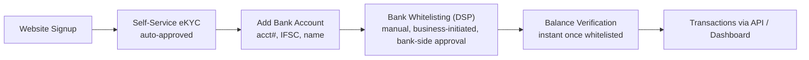
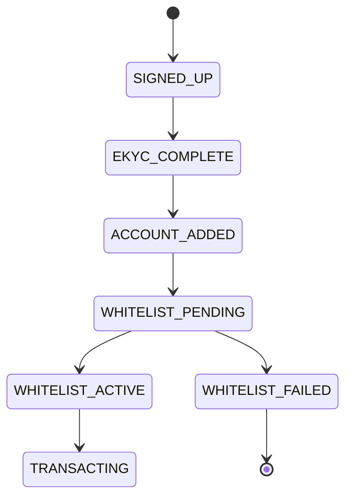
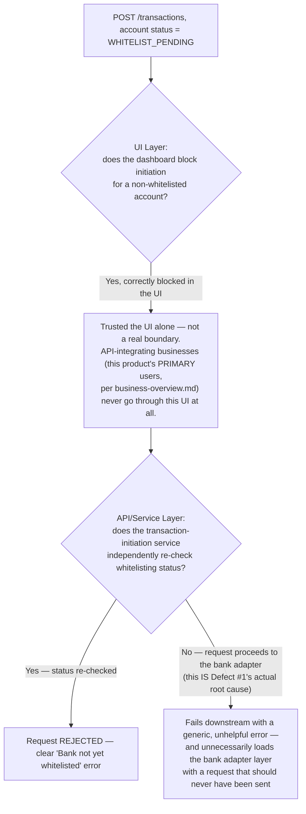
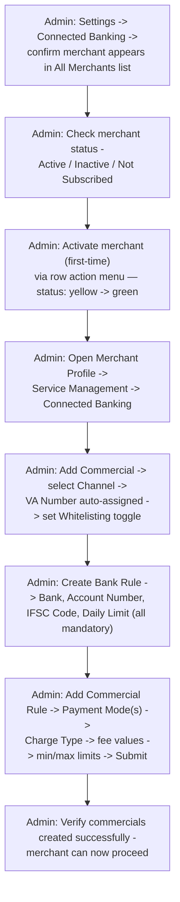
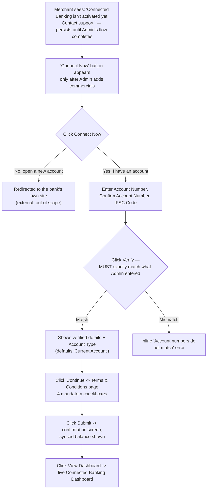
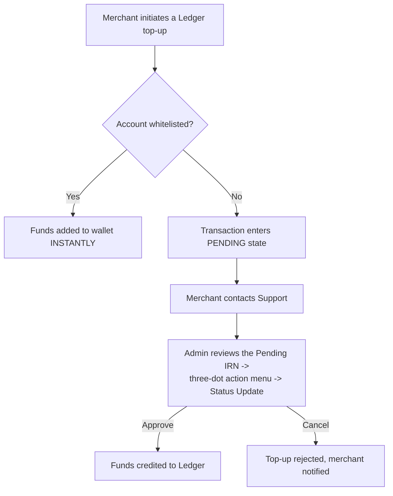
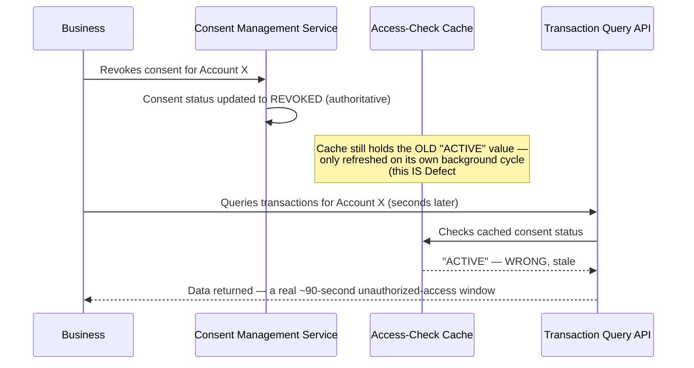
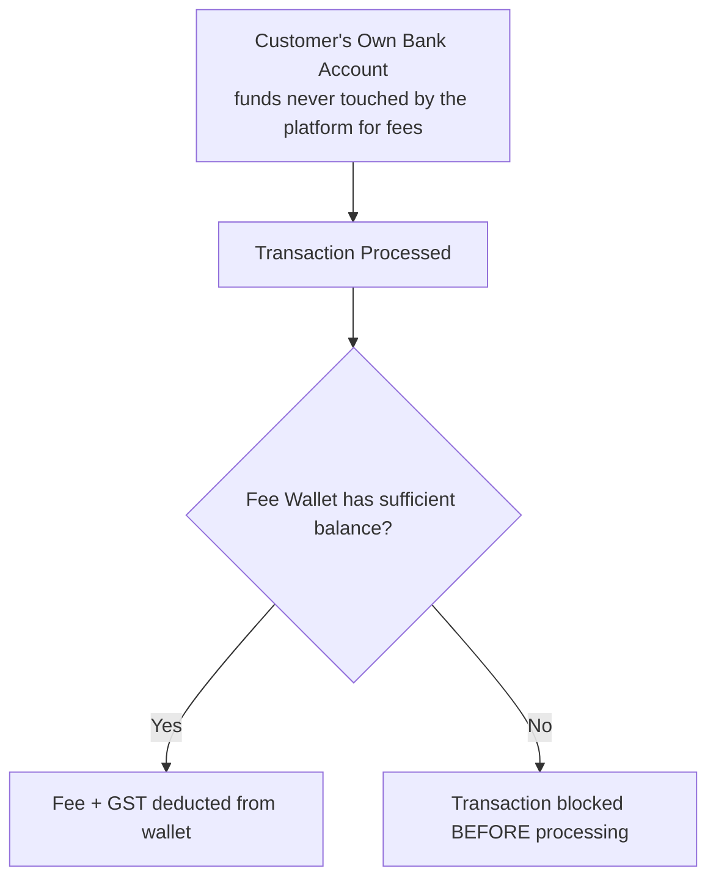
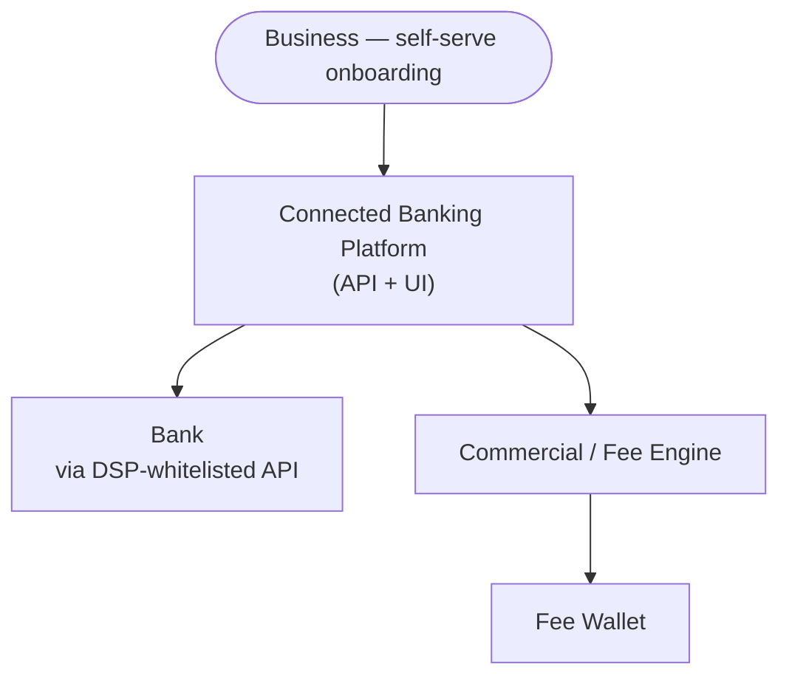

# Connected Banking — Architecture & Flow

> This is the internal, system-level "Tech Flow" view. For the non-technical, step-by-step
> merchant/admin walkthrough this diagram is based on, see
> [`user-guide-activate-connected-banking.md`](./user-guide-activate-connected-banking.md). For
> the customer/business-facing journey, see [`business-flow.md`](./business-flow.md). For the
> service-level (microservice) view, see [`service-architecture.md`](./service-architecture.md).
> See [`README.md`](./README.md) for the full documentation map.
>
> Every diagram below is drawn in [Mermaid](https://mermaid.js.org/), which GitHub renders
> natively in-page — nothing here requires opening another site or tool to read it.

## Full Onboarding-to-Transaction Flow

## Onboarding State Machine (Testing View)

- **WHITELIST_PENDING** is the highest-risk state to test — it can persist for an unpredictable
  amount of time since it depends on external bank action
- Any transaction attempt while `WHITELIST_PENDING` or `WHITELIST_FAILED` must be blocked with a
  clear error, not silently queued or dropped — see the next section for exactly what happens
  when that block isn't enforced everywhere it needs to be

## The Real Mechanism Behind Defect #1 — The Fourth Time This Portfolio Has Hit This Pattern

[`sample-defect-report.md`](../sample-defect-report.md) Defect #1 (a transaction proceeding
despite `WHITELIST_PENDING` status, when called via the API) is worth naming explicitly as a
*recurring* pattern, not a one-off: this portfolio's HRMS repo (a disabled form field with no
server-side equivalent), Reseller repo (a search endpoint missing tenant-ID scoping), and Payout
Engine repo (an approval check enforced only in the UI) all hit the exact same shape of defect,
in four completely different domains:

**Why this specific product makes the defect *more* consequential than it would be elsewhere:**
per [`business-overview.md`](./business-overview.md), this platform is "API-driven, not just a
dashboard" — its primary users integrate programmatically and may never touch the UI at all. A
check that only exists in the dashboard protects approximately none of this product's actual
traffic. The fix — enforce the whitelisting check at the API/service layer, not only in the UI —
isn't just good practice here; it's the only version of the fix that covers this product's
actual primary user base.

## Admin Activation Flow (Real, Detailed — Pre-Merchant-Onboarding Setup)

This is the concrete admin-side sequence that must complete *before* a merchant ever sees a
"Connect Now" button — captured from an actual activation SOP walkthrough, not a generic guess.

> ⚠️ The exact values entered in **Create Bank Rule** (Account Number, IFSC) must be re-entered
> identically by the merchant later — the single most common activation failure point.

**Testing implication:** every one of the "all mandatory" fields in Create Bank Rule and Add
Commercial Rule needs an explicit negative test (missing field, invalid IFSC format, daily
limit of zero, min > max on per-transaction limits) — none of this is optional/soft-validated
per the SOP's own "⚠️ critical" framing.

## Merchant Self-Service Connect Flow (Real, Detailed)

**Testing implication:** the account-number/IFSC match check (merchant-entered vs. admin-entered)
is the highest-value negative test in this entire flow — the real product surfaces this as an
inline "Account numbers do not match" validation error, which needs its own dedicated test
rather than being assumed to work because the happy path does.

## Dashboard: Two Distinct Balances (Bank Widget vs. Ledger Widget)

A completed Connect Flow lands the merchant on a dashboard with **two separate balance widgets**
that are easy to conflate but serve entirely different purposes:

| | Bank Widget (e.g. "Northbridge Bank") | Ledger Widget |
|---|---|---|
| **Shows** | The actual linked bank account balance | The platform wallet (fee) balance |
| **Quick Links** | Beneficiary, Reports, All Transactions | Whitelisting |
| **Purpose** | Reference only | Required to actually perform transactions |

**Testing implication:** a merchant can have a large Bank Widget balance and still be unable to
transact because the Ledger is empty — this is a common source of confused support tickets and
deserves explicit UI-copy and empty-state test coverage, not just "does the number display
correctly."

## Wallet (Ledger) Recharge Flow — Whitelisted vs. Non-Whitelisted

**Testing implication:** a Pending recharge must be a first-class, trackable state — it should
never look identical to a failed or a successful recharge in the UI, since the merchant's next
action (wait vs. contact support vs. retry) depends entirely on correctly recognizing which
state they're in. [`sample-defect-report.md`](../sample-defect-report.md) Defect #5 is exactly
this guarantee failing — see the sequence below for the actual mechanism.

## The Real Mechanism Behind Defect #4 — Consent Revocation as a Cache-Invalidation Race

**Why "eventually consistent" is the wrong model for a security boundary specifically:** a
background cache-refresh cycle is a completely reasonable pattern for data where a few seconds
of staleness is harmless. Consent is not that kind of data — per
[`sample-defect-report.md`](../sample-defect-report.md), "consent is a security boundary, not a
soft preference," and the fix is exactly what that distinction implies: either invalidate the
cache synchronously on revocation, or skip the cache entirely for this specific check and query
consent status directly. The ~90-second window in this defect is the gap between "the system of
record changed" and "every reader of that data found out" — the same category of problem as this
portfolio's YOBO repo (an in-flight data fetch outliving a revocation), here caused by caching
instead of request timing, but with the identical lesson: a security-relevant revocation has to
propagate before anything is allowed to act as if it hadn't happened.

## Fee Wallet Flow (Fee Deduction on Transactions)

**Testing implication:** the fee check and the transaction itself are two separate systems of
record (customer's bank balance vs. platform's fee wallet balance). A common defect pattern in
this category of product is these two checks becoming inconsistent — e.g. a transaction
succeeding on the bank side while fee deduction silently fails, or the reverse.

## Commercial Slab Boundary Map (Illustrative)

| Slab | Range | Fee |
|---|---|---|
| A | ₹0 – ₹1,000 | X |
| B | ₹1,001 – ₹25,000 | Y |
| C | ₹25,001 – ₹1,00,000 | Z |

Boundary values (₹1,000 vs. ₹1,001, ₹25,000 vs. ₹25,001) are the highest-value test points —
[`sample-defect-report.md`](../sample-defect-report.md) Defect #2 is exactly an off-by-one at the
₹25,000/₹25,001 boundary, where a `<` instead of `<=` comparison let both amounts fall into the
same (wrong, for one of them) slab.

## System Interaction Map

---

See [`load-testing-report.md`](../load-testing-report.md) for the real, executed load test
behind this architecture's throughput and latency characteristics (405,067 transactions, ~80.2
TPS sustained, 0.001% error rate) — those are genuine results, not an illustrative figure like
the slab map above.
