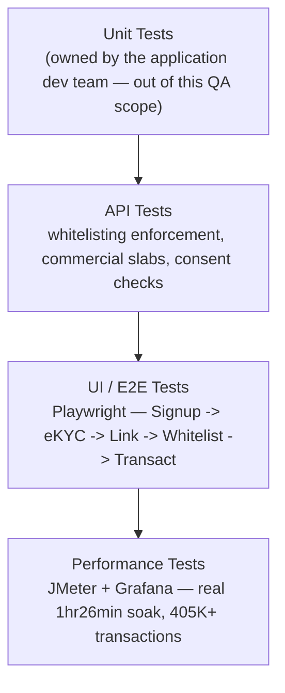
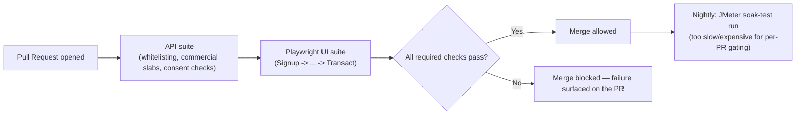

# Connected Banking — Tech Stack & Skills Demonstrated

> Everything in this doc is answerable by reading this repo alone — no need to visit an external
> site to understand what was used or why. This doc is a **skill-oriented index** into content
> that's already documented elsewhere in this repo (business-overview, business-flow,
> feature-modules, service-architecture, the real activation SOP, and the real executed load
> test) — it doesn't duplicate that content, it cross-references it by *skill* rather than by
> *product flow*, which none of those other docs do.

## 1. Full Tech Stack, and Why Each Tool

| Category | Tool | Why This Tool Specifically |
|---|---|---|
| **UI Automation** | Playwright, TypeScript | See [`../automation/README.md`](../automation/README.md) for the framework rationale |
| **API Testing & Automation** | Playwright API requests, Postman | Validates whitelisting-status enforcement, transaction initiation, and multi-bank routing directly against the contract — critically, independent of the UI (see [`architecture-and-flow.md`](./architecture-and-flow.md)'s Defect #1 mechanism) |
| **Performance Testing** | JMeter, Grafana | Real, executed load testing — see section 5 below and [`../load-testing-report.md`](../load-testing-report.md) for the actual results (405,067 transactions, ~80.2 TPS sustained), not an illustrative placeholder |
| **CI/CD** | Jenkins | Automates the regression suite on a schedule/trigger |
| **Bug Tracking & Traceability** | JIRA, RTM | Full defect lifecycle tracking plus requirement-to-test-coverage traceability — see [`../sample-rtm.md`](../sample-rtm.md) |
| **Version Control** | Git, GitHub | This repo itself; diagrams throughout `architecture-and-flow.md` are Mermaid, which GitHub renders natively with zero extra tooling |

## 2. Skills Demonstrated — Skill → Where to See It

| Skill | Demonstrated By | Where to Look |
|---|---|---|
| **Manual / Functional Testing** | Full Signup-to-Transaction regression suite (65 cases) | [`../regression-checklist.md`](../regression-checklist.md) |
| **API Testing** | Whitelisting enforcement, transaction initiation, multi-bank routing | [`../regression-checklist.md`](../regression-checklist.md) |
| **UI Automation** | Playwright spec covering the onboarding-to-transaction journey | [`../automation/sample-onboarding.spec.ts`](../automation/sample-onboarding.spec.ts) |
| **Integration Testing** | Bank whitelisting status propagation, multi-bank routing across the onboarding pipeline | [`../README.md`](../README.md#-my-role) |
| **Performance / Load Testing** | A real, management-grade executive report: 405,067 transactions, 1hr 26min sustained run, P90/P95/P99 latency, root-caused to a Redis capacity limit, not an application defect | [`../load-testing-report.md`](../load-testing-report.md) |
| **Financial-Correctness / Boundary Testing** | Commercial slab boundary testing, ledger/balance cent-level accuracy validation under load | [`../load-testing-report.md`](../load-testing-report.md) section 16 |
| **Security-Adjacent Testing (Consent/Access Boundaries)** | Identifying a real unauthorized-access window caused by cache-invalidation timing, not just a functional gap | [`../sample-defect-report.md`](../sample-defect-report.md) Defect #4; [`architecture-and-flow.md`](./architecture-and-flow.md) |
| **Requirement Traceability (RTM)** | A worked requirement → test case → status mapping | [`../sample-rtm.md`](../sample-rtm.md) |
| **Defect Management & Root-Cause Analysis** | Five worked defects identifying the actual mechanism (API-layer gap, off-by-one slab comparison, two code paths with an undocumented inclusion-rule difference, a caching race, a missing status badge) rather than just the symptom | [`../sample-defect-report.md`](../sample-defect-report.md) |
| **Technical Documentation & Communication** | The full eight-document `docs/` set, including a real non-technical activation SOP written for a non-QA audience | [`user-guide-activate-connected-banking.md`](./user-guide-activate-connected-banking.md) |

## 3. The Testing Pyramid Applied to This Project

**Why this pyramid is already backed by a genuinely real, documented result:** per
[`../load-testing-report.md`](../load-testing-report.md), this isn't a hypothetical performance
section — it's an executive-level report with a concrete root cause (Redis queue memory
saturation, explicitly ruled out as an application-layer defect) and a verified financial-
correctness finding (zero cent-level ledger discrepancies under sustained load). That's worth
naming explicitly: this is the one repo in this portfolio where the performance-testing evidence
is a real artifact, not an illustrative shape.

## 4. CI/CD — Suggested Pipeline Shape

> **Note on scope, matching this repo's existing honesty convention** (see
> [`../automation/README.md`](../automation/README.md)): this repo includes one representative
> Playwright spec rather than the full framework, to stay focused as a portfolio piece.

## 5. Performance Testing — Pointing at the Real Result, Not Repeating It

Rather than re-describing [`../load-testing-report.md`](../load-testing-report.md)'s content
here, the useful thing this section can add is *why* its specific findings matter for this
domain specifically:

| Finding | Why It's the Right Thing to Have Checked, for This Product Specifically |
|---|---|
| **Redis queue memory saturation as the limiting factor, not application logic** | This product's transaction path (section 3 of `architecture-and-flow.md`'s diagrams) routes every transaction through a queue before the bank adapter — a queue-capacity limit is exactly the kind of bottleneck that only shows up under sustained volume, never in a quick functional smoke test |
| **Zero cent-level ledger discrepancies under 405,000+ transactions** | Per [`architecture-and-flow.md`](./architecture-and-flow.md)'s Fee Wallet Flow section, this product runs two parallel systems of record (customer bank balance, platform fee wallet) that are a known source of drift elsewhere in this portfolio (see Defect #3's Mini Statement mismatch) — confirming exact ledger accuracy *specifically under load*, not just in a clean test environment, is the test that actually rules out a volume-triggered version of that same drift pattern |
| **P99 latency reported alongside P90/P95, not just an average** | Per this portfolio's own recurring principle, P99 represents the worst realistic customer experience — reporting it transparently (1,500ms, clearly separated from the much faster P90/P95) rather than only a flattering average is what makes this report credible as a real assessment rather than a marketing figure |

## 6. Why This Doc Exists Separately From the Other Docs

[`business-overview.md`](./business-overview.md), [`business-flow.md`](./business-flow.md),
[`feature-modules.md`](./feature-modules.md), [`service-architecture.md`](./service-architecture.md),
and [`user-guide-activate-connected-banking.md`](./user-guide-activate-connected-banking.md) are
all organized around the *product*. This doc is organized around *skills*, so a reader looking
for "where's the performance testing evidence" or "where's the security-adjacent testing proof"
doesn't have to reconstruct that index themselves from five product-oriented documents.
